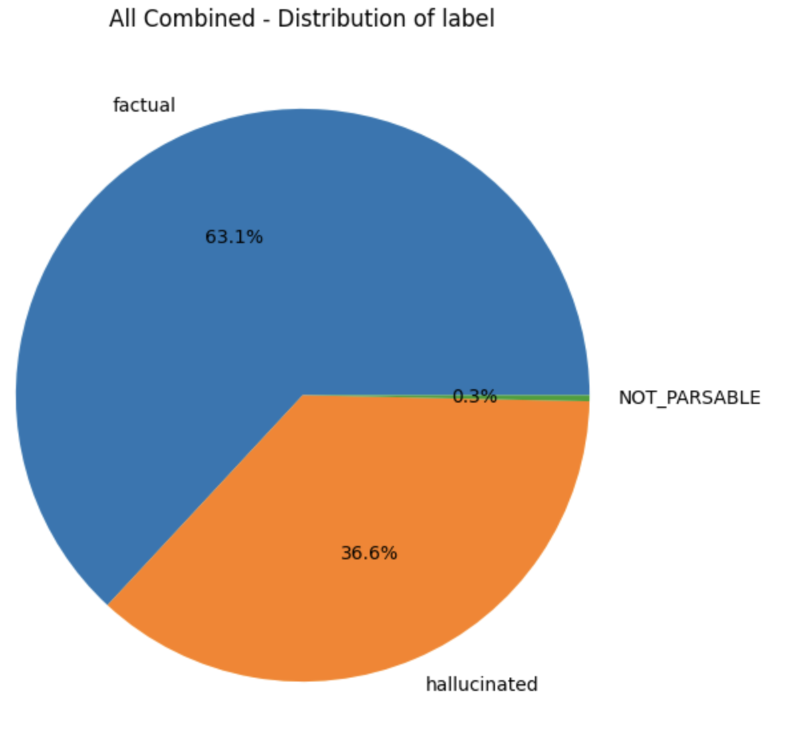
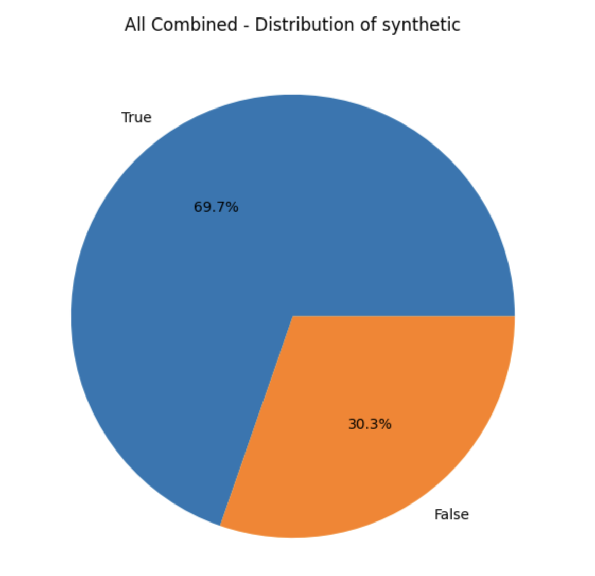
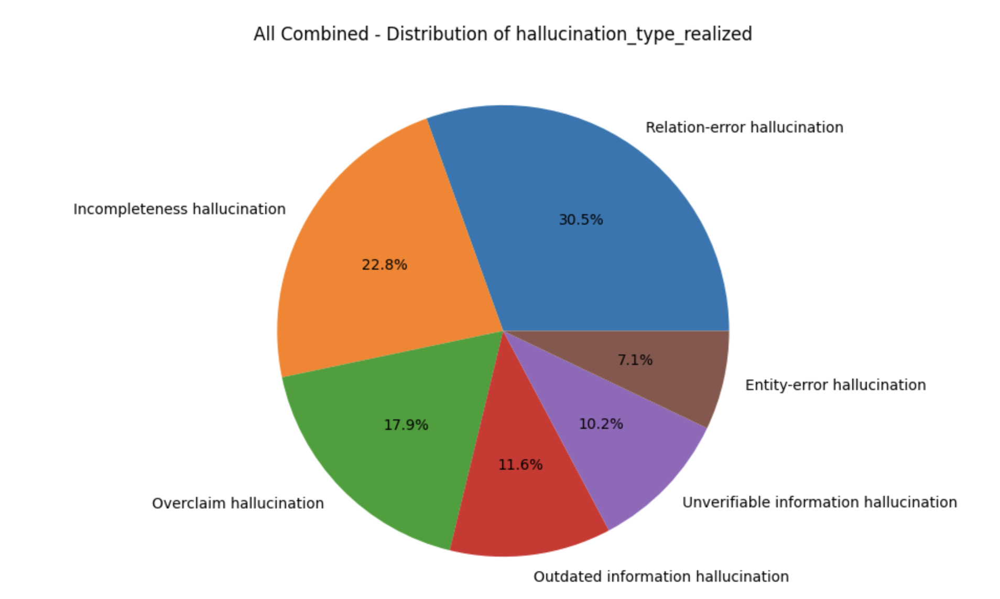
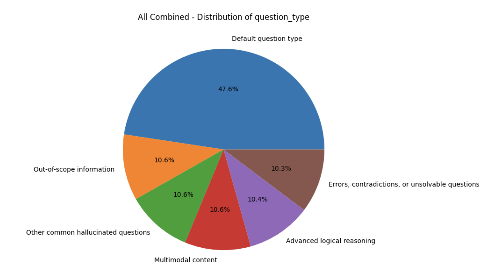
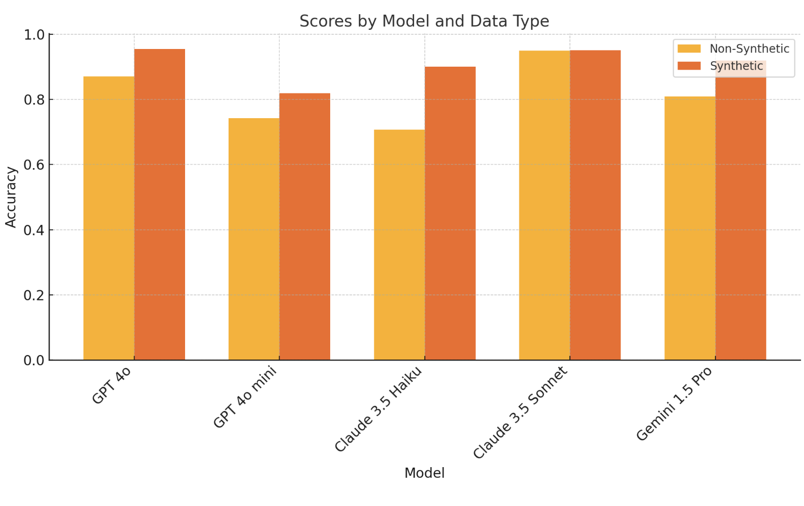

# Arize OpenEval Hallucination - An Open Source Dataset for Evaluating Hallucination in LLMs

In an effort to provide open source datasets for evaluating hallucination in LLMs, we've created this repository of datasets, generation scripts, and model evaluation scripts.
* Benchmark your hallucination evaluation models using these RAG hallucination datasets
* Fine-tune your own hallucination evaluation models
* Create your own benchmarking datasets on your own datasources using the generation scripts

This repository includes scripts to download documentation from a specified URL, generate a Q&A dataset from the content, and label the dataset with hallucination and factual indicators in the generated answers. Additionally, it provides an option to evaluate various hallucination models on the labeled dataset.

## Ready-to-use Labeled Hallucination Datasets

`labeled_datasets` and `combined_datasets_for_evals` directories contain 66.5k labeled hallucination examples. `labeled_datasets` contain individual 500-example datasets for each combination of input parameters. `combined_datasets_for_evals` contains combinations of these individual datasets to create larger datasets for evaluation. 

All datasets were generated using the code in this repository, and can be used to evaluate or train your own hallucination models.

Datasets are varied in the following ways:
1. **Model used for the RAG generation** (GPT-4o, Claude-3-5-Sonnet, Llama 3.1 8B)
2. **Original context source** (spans technical, legal, and scientific domains)
3. **Language**
4. **Synthetic vs Non-synthetic hallucinations** - cases where we encouraged the model to hallucinate (synthetic) vs cases where we allowed the model to hallucinate naturally (non-synthetic)
5. **Hallucination type** - the type of hallucination (e.g. relational error, overclaiming, etc.)
6. **Question type** - the type of question (e.g. out-of-scope information, multimodal prompting, etc.)

### Analysis of the datasets
In total, we've generated 70k+ labeled hallucination examples. 

These are distributed across 100+ datasets, each with 500 examples. 









For more analysis of the datasets, see [dataset_analysis.ipynb](dataset_analysis.ipynb).

### Benchmarking existing models on the datasets

We've benchmarked the following models on balanced datasets for both synthetic and non-synthetic hallucinations:

| Model | Synthetic vs Non-Synthetic | Accuracy | F1 Score | Precision | Recall |
|-------|---------------------------|-----------|-----------|------------|---------|
| GPT 4o | non-synthetic | 0.871 | 0.857 | 0.972 | 0.767 |
| GPT 4o mini | non-synthetic | 0.742 | 0.658 | 0.976 | 0.496 |
| Claude 3.5 Haiku | non-synthetic | 0.707 | 0.599 | 0.956 | 0.437 |
| Claude 3.5 Sonnet | non-synthetic | 0.950 | 0.949 | 0.977 | 0.922 |
| Gemini 1.5 Pro | non-synthetic | 0.809 | 0.776 | 0.938 | 0.662 |
| GPT 4o | synthetic | 0.955 | 0.954 | 0.965 | 0.944 |
| GPT 4o mini | synthetic | 0.819 | 0.785 | 0.965 | 0.662 |
| Claude 3.5 Haiku | synthetic | 0.901 | 0.897 | 0.965 | 0.837 |
| Claude 3.5 Sonnet | synthetic | 0.951 | 0.952 | 0.933 | 0.972 |
| Gemini 1.5 Pro | synthetic | 0.920 | 0.918 | 0.955 | 0.884 |



## Methodology

### Dataset Generation

These datasets are all generated using this process:
1. Download website content from a specified URL
2. Use a data prep LLM (GPT 4o by default) to generate questions on specific sections of the website content, as well as answers to those questions.
3. Use a combination of three judge LLMs to label the answers as hallucinated or factual. All judges must agree for a factual label to be applied.
4. Human in the loop review of the dataset and generated labels.

### Model Evaluation using Generated Datasets

Model evaluation was done using the Arize Phoenix python library - the relevant code is in `src/evaluate_model.py`.

Hallucination evaluation prompt (from the [Arize Phoenix library](https://github.com/Arize-ai/phoenix/blob/ecef5242d2f9bb39a2fdf5d96a2b1841191f7944/packages/phoenix-evals/src/phoenix/evals/span_templates.py#L7)):

    In this task, you will be presented with a query, a reference text and an answer. The answer is
    generated to the question based on the reference text. The answer may contain false information. You
    must use the reference text to determine if the answer to the question contains false information,
    if the answer is a hallucination of facts. Your objective is to determine whether the answer text
    contains factual information and is not a hallucination. A 'hallucination' refers to
    an answer that is not based on the reference text or assumes information that is not available in
    the reference text. Your response should be a single word: either "factual" or "hallucinated", and
    it should not include any other text or characters. "hallucinated" indicates that the answer
    provides factually inaccurate information to the query based on the reference text. "factual"
    indicates that the answer to the question is correct relative to the reference text, and does not
    contain made up information. Please read the query and reference text carefully before determining
    your response.

    # Query: {query}
    # Reference text: {reference}
    # Answer: {response}
    Is the answer above factual or hallucinated based on the query and reference text?

# Using the scripts in this repository
> Start by installing the `src/requirements.txt` dependencies and setting environment variables to match `.env.example`.

## Dataset Generation

The same code used to generate the labeled datasets can be used to generate your own datasets. We've made this easy by providing a single command that will generate a dataset based on the parameters you provide:

```bash
python src/main.py \
  --language=en \
  --website=https://docs.databricks.com/en/index.html \
  --data-prep-llm=gpt-4o-mini \
  --questions-per-doc=3 \
  --use-default-templates=false \
  --provide-explanation=true \
  --ignore-if-exists=false \
  --hallucinations=30 \
  --synthetic=true \
  --qa-variation=answers
```

The output of this command will be saved to `labeled_datasets/` in a nested directory structure based on the input parameters.

## Model Evaluation

This repository also includes a script to evaluate existing models on a labeled dataset file.

To trigger the evaluation, run the following command:

```bash
python src/main.py \
  --dataset-to-evaluate="labels_datasets/docs_snowflake_com/labels_gpt_synthetic_gpt__en.csv" \
  --evaluation-models=litellm/groq/llama3-70b-8192,gpt-4o-mini
```

## Repository Structure

- The primary script is located in `src/main.py`.
- Required dependencies are listed in `src/requirements.txt`.
- Set up the necessary environment variables for each model you wish to utilize. The code defaults to using the OpenAI and Mistral APIs.

The output files are organized in local directories to facilitate skipping previously completed steps:

- **Labeled Datasets** are saved in `/labeled_datasets/`.
- **Merged Datasets** are saved in `/combined_datasets_for_evals/` and `/combined_datasets_for_finetuning/`.
- **Evaluation results** are saved in `/evaluation_results/`.
- **Temporary checkpoint files** are saved in `/data/`.

### Command-Line Parameters
These parameters are accepted by the `src/main.py` script, for either dataset generation or model evaluation.

| Argument               | Type   | Required | Default  | Description                                                                                     |
|------------------------|--------|----------|----------|-------------------------------------------------------------------------------------------------|
| `--website`            | `str`  | Yes      |          | URL of the documentation to download and process.                                                            |
| `--data-prep-llm`      | `str`  | Yes      |          | Language model for data preparation (options: `gpt-4o-mini`, `claude-3-5-sonnet-latest`, `litellm/groq/llama3-70b-8192`).                              |
| `--judge-llm1`         | `str`  | Yes      |          | First model for labeling (options: `gpt-4o-mini`, `claude-3-5-sonnet-latest`, `mistral-large-latest`, `litellm/groq/llama3-70b-8192`).                             |
| `--judge-llm2`         | `str`  | No      |          | Second model for labeling, distinct from `judge-llm1`.                                        |
| `--synthetic`          | `str`  | No       | `true`   | Indicates whether to generate synthetic answers.                                                |
| `--language`           | `str`  | No       | `en`     | Language for processing, process in iso code (default is English).                                                   |
| `--max-depth`          | `int`  | No       | `20`     | Maximum depth for document crawling.                                                            |
| `--use-default-templates`     | `str`  | No       | `true`    | true - it will use the prompt templates from phonix else it will use from prompts.py file|
| `--hallucinations`    | `int`  | No       | `0`      | Number of hallucinations to generate, number of documents will be decided based on this value and numer of questions per doc.                                                             |
| `--questions-per-doc`  | `int`  | No       | `2`      | Number of questions to generate per document.                                                  |
| `--no-of-docs`         | `int`  | No       | `0`      | Number of documents to process. This value will be overriden if --hallucinations provided.                                                                  |
| `--evaluation-models`  | `str`  | No       | `gpt-4o` | Comma-separated list of models for evaluation (e.g., `gpt-4o`, `gpt-4o-mini`). Supports gpt, anthropic, mistral, litellm model strings. Also supports huggingface hub models using the prefix `huggingfacelocal/` (e.g. `huggingfacelocal/jgilhuly16/qwen2.5-1.5b-rd-1`)                 |
| `--ignore-if-exists`   | `str`  | No       | `true`   | If true, skips re-generating existing Q&A and labels.                                          |
| `--provide-explanation`| `str`  | No       | `true`   | If true, explanations will accompany each label.                                               |
| `--dataset-to-evaluate` | `str` | No    |          | Path to the CSV file for judge labels (only required if not providing `website`, `data-prep-llm`, and `judge-llm1`). |
| `--force-even-split`      | `str` | No    | `false` | If true, forces an even split of hallucinations and factual answers across the dataset. Only used if `--synthetic=true`. |
| `--enable-observability`  | `str` | No    | `false` | If true, enables observability logging to Arize Phoenix. |

### Environment Variables

- Ensure that model API keys are provided as environment variables. Provide `API_BASE_URL` for supporting the huggingface models with LiteLLM
- Provide `PHOENIX_API_KEY`, `PHOENIX_COLLECTOR_ENDPOINT` `OTEL_EXPORTER_OTLP_HEADERS` for phoenix metrics

See the `.env.example` file for reference.

### Additional Usage Notes
- Dataset Generation: If no dataset (Q&A or labels) is available in the output dir, the script will generate a complete dataset. Alternatively, if `--judge-labels-csv-path` is provided, it will use the specified file and proceed to generate evaluation results based on the labels.
- Evaluation models are dynamically initialized according to the specified model prefix (`gpt`, `mistral`, `claude`). You can provide the full name of the model, ex: claude-3-5-sonnet-latest, mistral-large-latest.
- You can update the prompts in prompts.py to override the prompt templates from Phoenix by setting --use-default-templates=false.
- data-prep-llm, judge-llms, evaluation-models will support litellm supported models using the `litellm/` prefix.
- evaluation-models will support huggingface hub models using the prefix `huggingfacelocal/` (e.g. `huggingfacelocal/jgilhuly16/qwen2.5-1.5b-rd-1`)

## Acknowledgements
We'd like to thank the following people for their contributions to this repository:
- Satya Srinivasu
- Jon Saad
- The Arize team: John Gilhuly, Nick van Nest, Julia Gomes, Aman Khan, Aparna Dhinakara, Jason Lopatecki